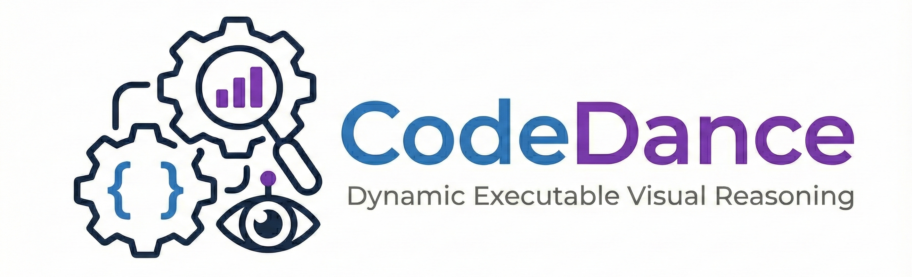
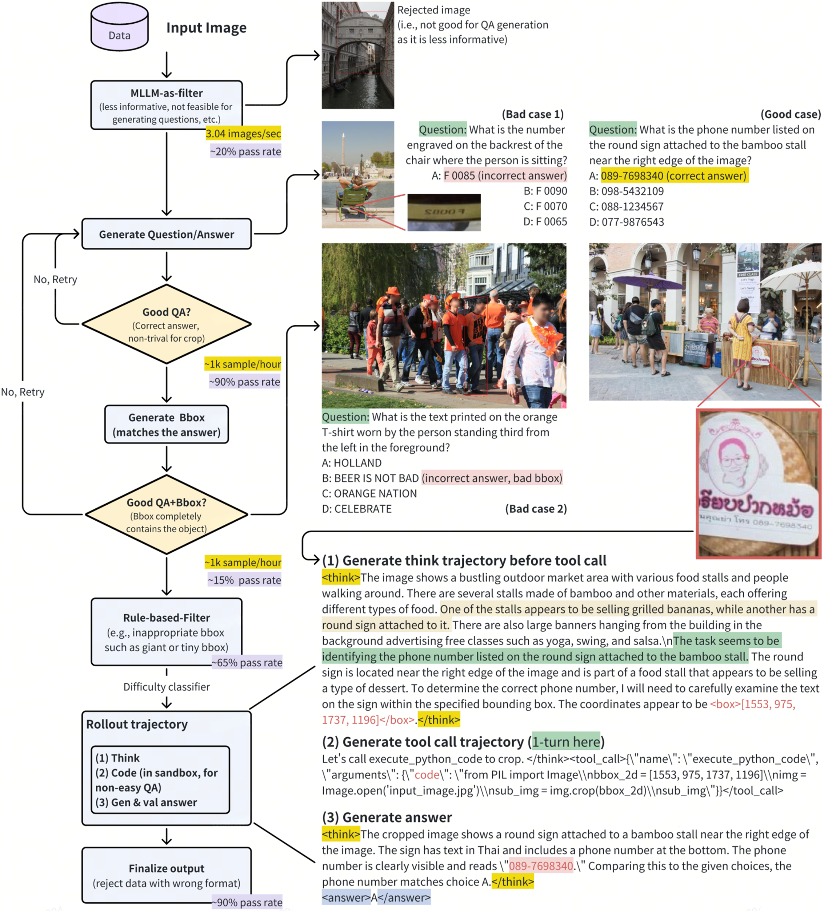

<div align="center"> 
   
  <h1>CodeDance: A Dynamic Tool-integrated MLLM for Executable Visual Reasoning</h1>
</div> 

<div align="center"> 

[](https://arxiv.org/abs/2512.17312) [](https://huggingface.co/datasets/Peterwatwec/CodeDance-SFT) [](https://opensource.org/licenses/MIT) [](https://www.python.org/downloads/) [](https://codedance-vl.github.io/) 
</div>

## 📣 Latest News 
- **[2025/12/19]**: 🔥 We released the [CodeDance paper](https://arxiv.org/abs/2512.17312), [project website](https://codedance-vl.github.io/), and the [CodeDance-SFT](https://huggingface.co/datasets/Peterwatwec/CodeDance-SFT) dataset containing 34k executable trajectories.
- **[2025/12/19]**: 📄 We introduced CodeDance, a dynamic tool-integrated MLLM that treats executable code as a general solver for visual reasoning.

--- 

## :mag_right: Roadmap 
**🛠️ CodeDance is under active development.**

We are working on releasing the code and models. We sincerely welcome contributions to this open-source toolkit.
- [x] Release Paper
- [ ] Release Dataset
- [ ] Release Code
- [ ] Release Model

--- 

## 📑 Contents 

- [📣 Latest News](#-latest-news)
- [:mag\_right: Roadmap](#mag_right-roadmap)
- [📑 Contents](#-contents)
- [💡 Overview](#-overview)
- [🛠️ Installation](#️-installation)
- [🚀 Usage](#-usage)
- [📂 Datasets](#-datasets)
- [💡 Methodology](#-methodology)
  - [Stage 1: Cold-start via Supervised Fine-tuning](#stage-1-cold-start-via-supervised-fine-tuning)
  - [Stage 2: Reinforcement Learning](#stage-2-reinforcement-learning)
  - [Stage 3: Test-Time Extend and Scaling](#stage-3-test-time-extend-and-scaling)
- [📄 Citation](#-citation)
- [🤝 Acknowledgement](#-acknowledgement)

--- 

## 💡 Overview 

> "We introduce CodeDance, a dynamic tool-integrated multimodal large language model that treats executable code as a general solver for visual reasoning."

**CodeDance** scales up multimodal tool-based reasoning by letting the model think, write code, execute it, and reflect in a single loop. Instead of relying on rigid, text-only pipelines, CodeDance:
1.  **Plans & Composes**: Dynamically decides when and how to invoke tools.
2.  **Executes**: Orchestrates visual-symbolic operations (crop, draw, count, plot) in a sandbox.
3.  **Reflects**: Uses intermediate visual evidence to guide subsequent reasoning.

This design yields transparent, self-checkable solutions to challenging visual search and reasoning tasks.

## 🛠️ Installation

> [!NOTE]
> CodeDance code will be released soon. Please stay tuned!

## 🚀 Usage

> [!NOTE]
> Usage instructions and inference demos will be updated upon code release.

## 📂 Datasets 

<div align="center"> 

| Dataset | Description | Size | Download |
| :--- | :--- | :--- | :--- |
| **CodeDance-SFT** | Executable multi-turn/single turn trajectories for cold-start | 34k | [HuggingFace](https://huggingface.co/datasets/Peterwatwec/CodeDance-SFT) |
| **CodeDance-RL** | Data for reinforcement learning optimization | - | [Coming Soon] |

</div> 

<div align="center"> 
 
</div> 

## 💡 Methodology

<div align="center">
  
</div>

The CodeDance pipeline consists of three stages:

### Stage 1: Cold-start via Supervised Fine-tuning
We construct a **34k high-quality dataset** of executable multi-turn trajectories to initialize the model.
*   **Weak-to-strong filtering**: Pruning trivial cases with Qwen2.5-VL-7B and stratifying difficulty.
*   **Multi-turn atomic supervision**: Decomposing hard cases into verifiable executable trajectories:
    *   *Predefined visual operations*
    *   *Mathematical computation*
    *   *Open-ended operations*

### Stage 2: Reinforcement Learning
We optimize with a composite reward mechanism: **Balanced Adaptive Tool-call**.
*   **Sequence-level**: Difficulty-aware incentives to discourage redundant calls on easy problems.
*   **Turn-level**: Immediate penalties for failed executions plus dense correction advantages.

### Stage 3: Test-Time Extend and Scaling
Without task-specific fine-tuning, CodeDance exhibits emergent capabilities beyond supervised primitives.

---

## 📄 Citation

If you find our work helpful, please cite:

```bibtex
@article{song2025codedance,
  title={CodeDance: A Dynamic Tool-integrated MLLM for Executable Visual Reasoning},
  author={Song, Qi and Li, Honglin and Yu, Yingchen and Zhou, Haoyi and Yang, Lin and Bai, Song and She, Qi and Huang, Zilong and Zhao, Yunqing},
  journal={arXiv preprint arXiv:2512.17312},
  year={2025}
}
```

---

## 🤝 Acknowledgement
CodeDance is built upon excellent open-source works, specifically [verl](https://github.com/volcengine/verl) and [ms-swift](https://github.com/modelscope/ms-swift). We thank the community for their contributions.
