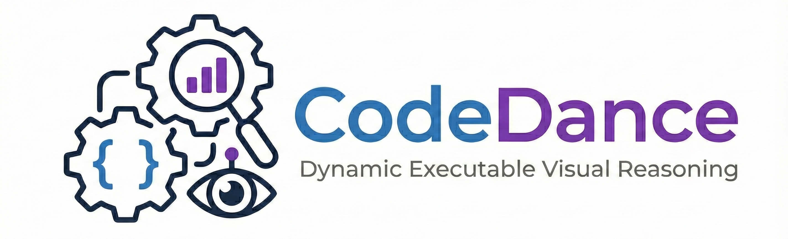
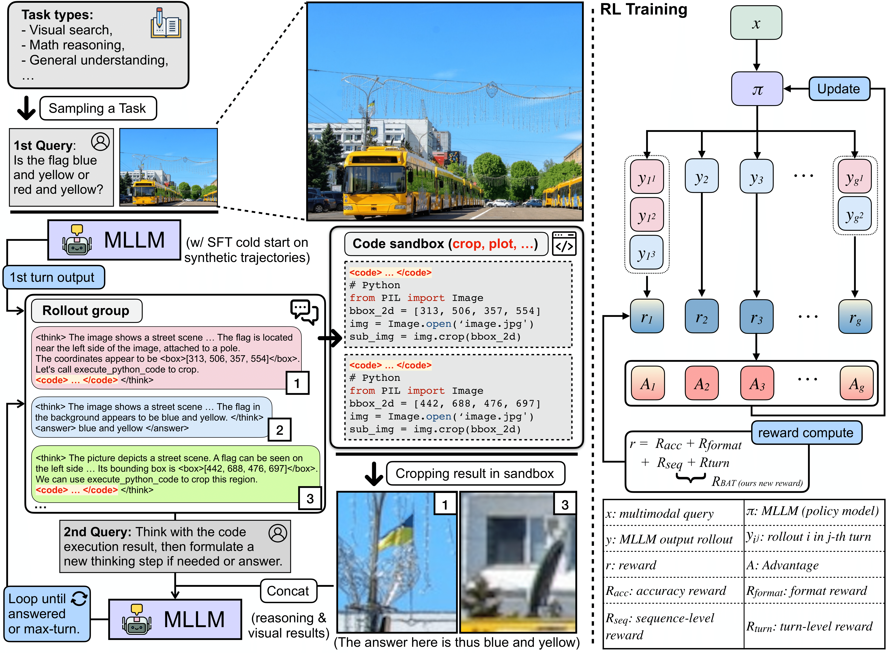
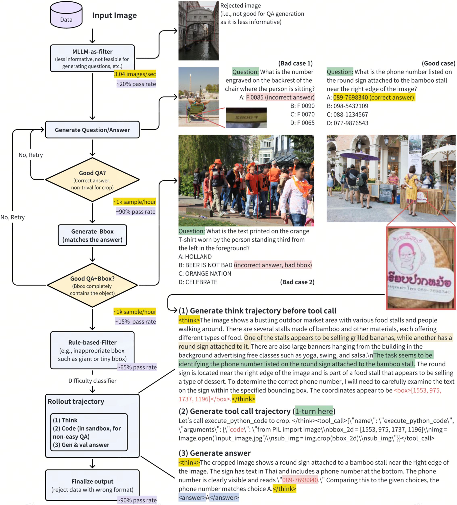

# CodeDance: Layout-Aware Visual Memory for Efficient Long-Horizon Reasoning

<div align="center">
  

  <p align="center">
    <a href="https://arxiv.org/abs/2512.17312"></a>
    <a href="https://huggingface.co/datasets/Peterwatwec/CodeDance-SFT"></a>
    <a href="https://opensource.org/licenses/MIT"></a>
    <a href="https://www.python.org/downloads/"></a>
    <a href="https://codedance-vl.github.io/"></a>
  </p>
  
  <h1>CodeDance: A Dynamic Tool-integrated MLLM for Executable Visual Reasoning</h1>
</div>


### 🔥 News
- **[2026-02]**: 🔥 We released Training scripts for CodeDance.
- **[2025-12]**: 🤗 We released the [CodeDance paper](https://arxiv.org/abs/2512.17312), [project website](https://codedance-vl.github.io/), and the [CodeDance-SFT](https://huggingface.co/datasets/Peterwatwec/CodeDance-SFT) and [RL](https://huggingface.co/datasets/Peterwatwec/CodeDance-RL) dataset.
- **[2025-12]**: 🚀  We introduced CodeDance, a dynamic tool-integrated MLLM that treats executable code as a general solver for visual reasoning.

## 🌟 Overview

CodeDance is a dynamic tool-integrated multimodal large language model that treats executable code as a general solver for visual reasoning.

> "We introduce CodeDance, a dynamic tool-integrated multimodal large language model that treats executable code as a general solver for visual reasoning."

**CodeDance** scales up multimodal tool-based reasoning by letting the model think, write code, execute it, and reflect in a single loop. Instead of relying on rigid, text-only pipelines, CodeDance:
1.  **Plans & Composes**: Dynamically decides when and how to invoke tools.
2.  **Executes**: Orchestrates visual-symbolic operations (crop, draw, count, plot) in a sandbox.
3.  **Reflects**: Uses intermediate visual evidence to guide subsequent reasoning.

This design yields transparent, self-checkable solutions to challenging visual search and reasoning tasks.


## 💡 Method

<div align="center">
  
</div>

The CodeDance pipeline consists of three stages:

### Stage 1: Cold-start via Supervised Fine-tuning
We construct a **34k high-quality dataset** of executable multi-turn trajectories to initialize the model.
- **Weak-to-strong filtering**: Pruning trivial cases with Qwen2.5-VL-7B and stratifying difficulty.
- **Multi-turn atomic supervision**: Decomposing hard cases into verifiable executable trajectories:
  - *Predefined visual operations*
  - *Mathematical computation*
  - *Open-ended operations*

<div align="center"> 
 
</div> 

### Stage 2: Reinforcement Learning
We optimize with a composite reward mechanism: **Balanced Adaptive Tool-call**.
- **Sequence-level**: Difficulty-aware incentives to discourage redundant calls on easy problems.
- **Turn-level**: Immediate penalties for failed executions plus dense correction advantages.

### Stage 3: Test-Time Extend and Scaling
Without task-specific fine-tuning, CodeDance exhibits emergent capabilities beyond supervised primitives.


## 🛠️ Installation

### 1. Clone the repository

```bash
git clone https://github.com/CodeDance-VL/CodeDance.git
cd CodeDance
```

### 2. Install Dependencies

```bash
bash install.sh
```


## 🚀 Training

### Step 1: Prepare Data

<div align="center"> 

| Dataset | Description | Size | Download |
| :--- | :--- | :--- | :--- |
| **CodeDance-SFT** | Executable multi-turn/single turn trajectories for cold-start | 34k | [HuggingFace](https://huggingface.co/datasets/Peterwatwec/CodeDance-SFT) |
| **CodeDance-RL** | Data for reinforcement learning optimization | 63k | [HuggingFace](https://huggingface.co/datasets/Peterwatwec/CodeDance-RL) |

</div> 
You can download the datasets from huggingface. The structure of the datasets is as follows:

```
CodeDance/
├── CodeDance-RL/
│   ├── data
│   │   ├── train-00000-of-00039.parquet
│   │   ├── train-00001-of-00039.parquet
│   │   ├── ...
│   │   └── train-00038-of-00039.parquet
│   └── README.md
└── scripts/
    └── train.sh
```

#### RL Dataset Format

The RL dataset is formatted as follows:

```json
{
  "data_source": "DATA_SOURCE",
  "prompt": [
    {
      "role": "system",
      "content": "You are a helpful assistant.\n\nSolve the following problem step by step. You may write python code to assist with the user query. When an image is supplied, you can either use the preloaded PIL Image object `input_image` or access the image file directly via the **relative path** `'input_image.jpg'`."
    },
    {
      "role": "user",
      "content": "<image>Is the car on the left side of the person...."
    }
  ],
  "images": [
    "<IMAGE_BYTES_OR_PATH>"
  ],
  "ability": "ABILITIES",
  "reward_model": {
    "style": "rule",
    "ground_truth": "No, the car is not on the left side of the person."
  },
  "extra_info": {
    "split": "train",
    "index": 0,
    "answer": "No, the car is not on the left side of the person.",
    "question": "Is the car on the left side of the person",
    "need_tools_kwargs": true,
    "tools_kwargs": {
      "execute_python_code": {
        "create_kwargs": {
          "image": "<IMAGE_BYTES_OR_PATH>"
        }
      }
    }
  }
}
```


### Step 1: Deploy Judge

RL training scripts are provided in the `examples/` directory.

```bash
vllm serve Qwen/Qwen2.5-72B-Instruct \
  --port 18901 \
  --gpu-memory-utilization 0.8 \
  --max-model-len 32768 \
  --tensor-parallel-size 8 \
  --served-model-name "judge" \
  --trust-remote-code \
  --disable-log-requests \
  --host "::"
```

```bash
export LLM_AS_A_JUDGE_BASE="http://[Your_IP_here]:18901/v1"
```

### Step 2: Start Ray Cluster (Multi-Node)

**On the master node:**

```bash
ray start --head --port=<PORT>
```

**On worker nodes** (replace `<HEAD_IP>` with the head node's IP):

```bash
ray start --address=<HEAD_IP>:<PORT> \
```

### Step 3: Run RL Training


> **Note**: You may need to modify the paths (e.g., `PROJECT_DIR`, `PT_CKPT_PATH`, data paths) in the shell scripts to match your local environment.

## 📊 Evaluation

We provide an evaluation script in `eval/eval.py`. To run the evaluation, you need to first deploy both the judge model and the model to be evaluated as OpenAI-compatible APIs.

**Step 1: Set up the Judge Model API**
Ensure the judge model API is running (as described in Step 1 of RL Training) and set the environment variable:
```bash
export LLM_AS_A_JUDGE_BASE="http://[Your_IP_here]:18901/v1"
```

**Step 2: Deploy the Evaluated Model**
Deploy the model you want to evaluate using vLLM or a similar serving engine:
```bash
vllm serve /path/to/your/model \
  --port 18902 \
  --gpu-memory-utilization 0.8 \
  --max-model-len 32768 \
  --trust-remote-code \
  --disable-log-requests
```

**Step 3: Run the Evaluation Script**
Execute the evaluation script with the corresponding API endpoints:
```bash
python eval/eval.py \
  --model_name "CodeDance-7B" \
  --api_url "http://127.0.0.1:18902/v1" \
  --data_path "/Path/Eval_data.parquet" \
  --save_path "./save/" \
  --num_workers 8 \
  --data_source "default"
```

### Key Arguments:
- `--model_name`: Name of the model for saving results.
- `--api_url`: API URL(s) of the model being evaluated. Supports a comma-separated list for load balancing.
- `--data_path`: Path to the evaluation dataset in `.parquet` format.
- `--save_path`: Directory to save the evaluation results and statistics.
- `--data_source`: Dataset type for specific scoring logic.

### Evaluation Outputs
The script will output two files in the `save_path` directory:
1. `result_{model_name}_{dataset}.jsonl`: Detailed results for each sample, including predicted answers, multi-modal context, and tool execution history.
2. `stats_{model_name}.json`: Summary statistics, including accuracy (ACC), judge scores, and code execution success rates.

## 📚 Citation

If you find our work helpful, please cite:

```bibtex
@article{song2025codedance,
  title={CodeDance: A Dynamic Tool-integrated MLLM for Executable Visual Reasoning},
  author={Song, Qi and Li, Honglin and Yu, Yingchen and Zhou, Haoyi and Yang, Lin and Bai, Song and She, Qi and Huang, Zilong and Zhao, Yunqing},
  journal={arXiv preprint arXiv:2512.17312},
  year={2025}
}
```


## 🙏 Acknowledgements
CodeDance is built upon excellent open-source works:
- [veRL](https://github.com/volcengine/verl) as the reinforcement learning training framework;
- [ms-swift](https://github.com/modelscope/ms-swift) as the SFT framework;


Related Projects:
- [DeepEyes: Incentivizing “Thinking with Images” via Reinforcement Learning](https://github.com/Visual-Agent/DeepEyes)
- [Thyme: Think Beyond Images](https://github.com/yfzhang114/Thyme)
